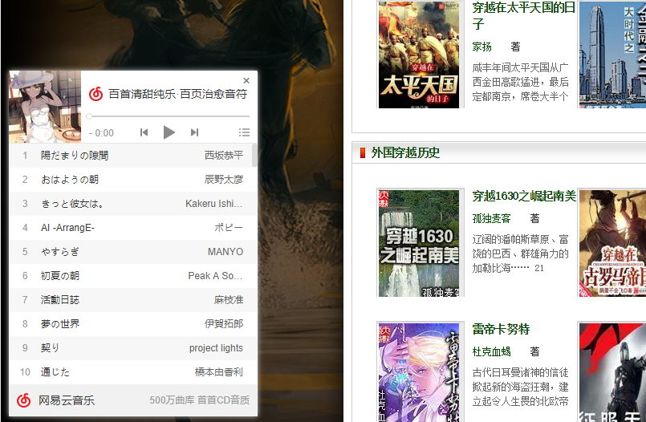

# wordpress-netease-cloud-music-website-player-plugin
a plugin help you to come true play netease cloud song sheet on your wordpress website        
## using way      
First open the plugin in your wordpress    
If you open the plugin, you will find as below
JL(IK}{D`4075([}L94X2.png)     
setting as you want,then you will find a icon like below show in your website.     
@C2DOD$33XKS_S530~G3F.png)       
click that icond, you will find like below,now your website has a player,can play your netease cloud music.
     
if you have any question,welcome to contact email 534878350@qq.com 

