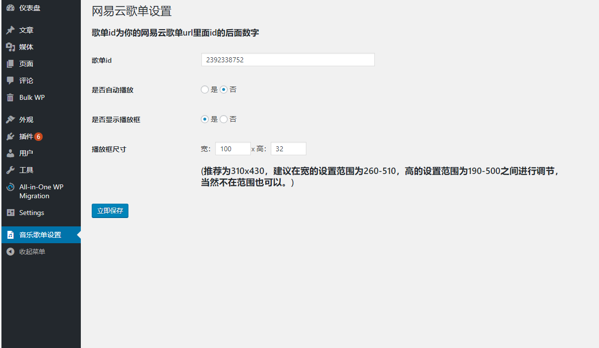
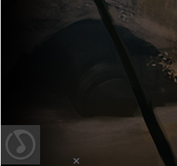
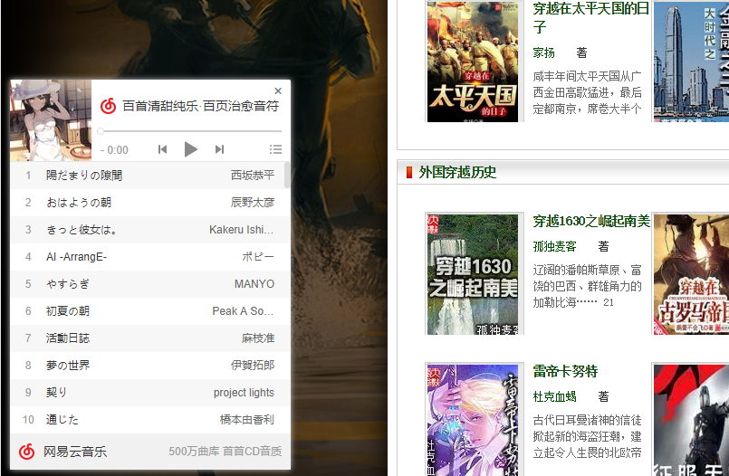

# wordpress-netease-cloud-music-website-player-plugin（网易云音乐播放器wordpress插件）
a plugin help you to come true play netease cloud song sheet on your wordpress website        
## using way      
First put the file to the wp-content\plugins\you creat folder and open the plugin in your wordpress backstage.     
If you open the plugin, you will find as below         
     
setting as you want,then you will find a icon like below show in your website.(if you chose don't show,will can't find that.)     
       
click that icond, you will find like below,now your website has a player,that can play your netease cloud music.
     
if you have any question,welcome to contact email 534878350@qq.com 
# 中文版
一个wordpress的插件帮助你实现在网站播放网易云歌单            
## 使用方法            
首先放文件到wp-content\plugins\你自己创造的文件夹 里面，并且在wordpress后台打开插件       
你开启插件后将出现下面的情况
      
按照你的喜好进行设置，然后进入你的wordpress站点你将发现以下图标在你的站点中          
         
点击图标，你将发现下面的情况，恭喜你能在你的网站放网易云音乐了。
                
如果你有任何问题，欢迎联系email 534878350@qq.com 
